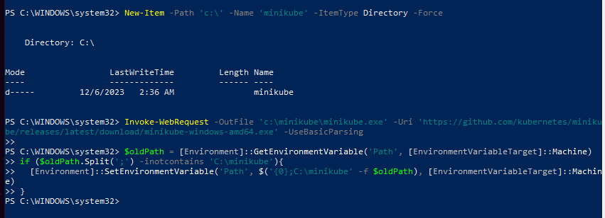
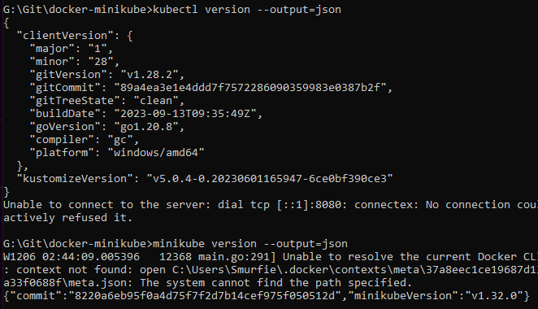
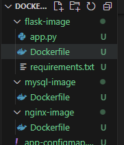
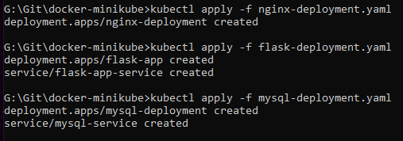
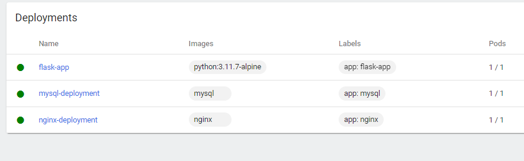
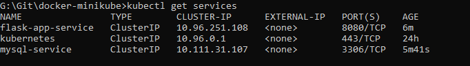

# myDevOps-Minikube

## Minikube Installation:
a.	Use a virtualization platform (e.g., VirtualBox) if not already installed. You can use your host OS if you have Docker Desktop Installed.

    Intalled on local PC

b.	Install Minikube by following the official installation instructions for your operating system.

c.	Verify the installation by running basic Minikube commands and checking the version.

## Deploying Applications:
a.	Create a custom Docker image for the application, which displays the pod name. (Use any repo from GitHub having a Docker File)
 
 Created all three docker images locally
    

b.	Create three deployments using the custom Docker image.
    

c.	Verify the successful deployment of the pods.
    

## Setting Up Services:
a.	Create a NodePort service to expose one of the deployments.

b.	Create a ClusterIP service to expose the second deployment.
    

c.	Create a LoadBalancer service to expose the third deployment.

d.	Verify the successful creation of the services.

## Accessibility Demonstration:
a. Explain why pods are inaccessible outside the cluster when using the ClusterIP service. 

"The ClusterIP Service is used for Pod-to-Pod communication within the same cluster. This means that a client running outside of the cluster, such as a user accessing an application over the internet, cannot directly access a ClusterIP Service."

b. Demonstrate how pods are accessible within the cluster using the NodePort service. 

"By default, without network policies, all Pods in the Kubernetes Cluster can reach other Pods, including from different namespaces (a namespace is not a network isolation!). You just have to use the Pod’s IP. No matter if they are exposed through a Service or not.
You cannot reach a Pod using its logical name. That’s exactly the purpose of the Service! Kubernetes provides a single DNS name for a set of Pods and can load-balance across them, that’s include NodePort as well.
If you already have created a NodePort service, you don’t have to create an additional ClusterIP service for internal traffic! You already have created a service that you can use for external and internal traffic!"

c. Demonstrate how pods are accessible from outside the cluster using the LoadBalancer service.

1. Create a service.yaml file
apiVersion: v1
kind: Service
metadata:
  name: nginx
  labels:
    name: nginx
spec:
  type: LoadBalancer
  ports:
    - port: 80
      name: http
  selector:
   name: nginx

service.yaml

2. Create a service file.

kubectl create -f service.yaml

3. To check service is created or not use below cmd.

kubectl get svc

4. Here you got a network load balancer endpoint.

## Documentation and Submission:
a.	Create a GitHub repository to host the YAML manifest files.

Whole manifest has been pushed to GH repo.

b.	Include a comprehensive README file with step-by-step instructions for setting up the Minikube cluster, deploying the applications, and demonstrating their accessibility.

>> this is the required README file

c.	Commit and push the YAML manifest files and the README to the GitHub repository.

DONE.

d.	Submit the link to the GitHub repository by the assignment deadline.

Here is the link: https://github.com/Smurfie07/myDevOps-Minikube.git

